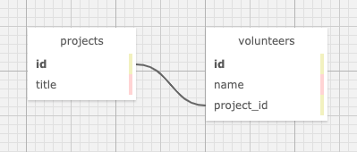

# _{README Template}_

#### By _**Jo Miller**_

### _This project was created solely for the education of the author(s) and is not in a complete or portfolio-ready state. It should not be considered representative of professional work._

\
[Epicodus](https://www.epicodus.com/) - [Ruby and Rails](https://www.learnhowtoprogram.com/ruby-and-rails/) - [Week 3](https://www.learnhowtoprogram.com/ruby-and-rails/ruby-database-basics/database-basics-independent-project)

Date created: 3/8/21–3/11/21
---

## Technologies Used

* _Ruby 2.6.5_
* _Embedded Ruby (ERB)_
* _Rspec 3.10_
* _Pry 0.14.0_
* _Capybara 3.35.3_
* _PostgreSQL 13.2_
* _Bundler 2.2.11_
* _Sinatra 2.1.0_
* _pg 1.2.3_
---

## Description

_An application that tracks projects and the volunteers working on them. Each volunteer can be assigned to one project, but each project can have many volunteers assigned to it. This app has the functionality to view, add, update and delete projects. Volunteers can also be added, updated, deleted, and searched for by name._
_Included below is a photo of the database table structure - each volunteer will have one project_id assigned to it._

---

## Setup/Installation Requirements

* _To clone this directory, navigate in your terminal to the desired location of the project and run command `git clone https://github.com/joanna-miller/volunteer-tracker.git`_
* _Navigate to top level of the directory with command `cd volunteer-tracker`_
* _To install bundler for managing gems run command `gem install bundler`_
* _To install gems into the project run command `bundle install`_
* _To use Visual Studio Code to edit this project, follow install instructions [here](https://code.visualstudio.com/)._
* _To enable command `code`, open VS Code, click on View > Command Palette, type in "shell command", and click on "Shell Command: Install 'code' command in PATH"_
* _Now, from your terminal, in the project's top level directory, you can run command `code .` to open project in VS Code._ 
* _{Database backup instructions}_
* _To run tests using rspec, run command `rspec`_
* _To run a live server, from the root level of the project directory in your terminal, run command `ruby app.rb`_
* _To interact with application, navigate to localhost:4567 in a web browser._
* _Exit live server, press Ctrl+C in your terminal_ 

---

## License

[MIT](LICENSE.txt)

---

## Contact Information

* _[Email](mailto:joannadawnmiller@gmail.com)_
* _[Github](https://github.com/joanna-miller)_
* _[LinkedIn](https://www.linkedin.com/in/jomillerde/)_